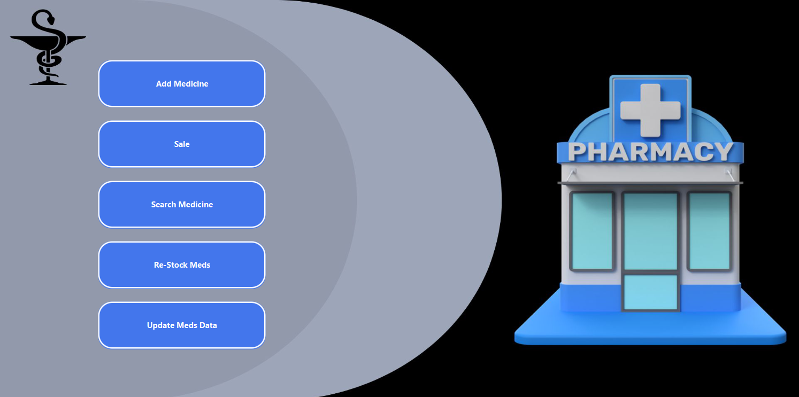
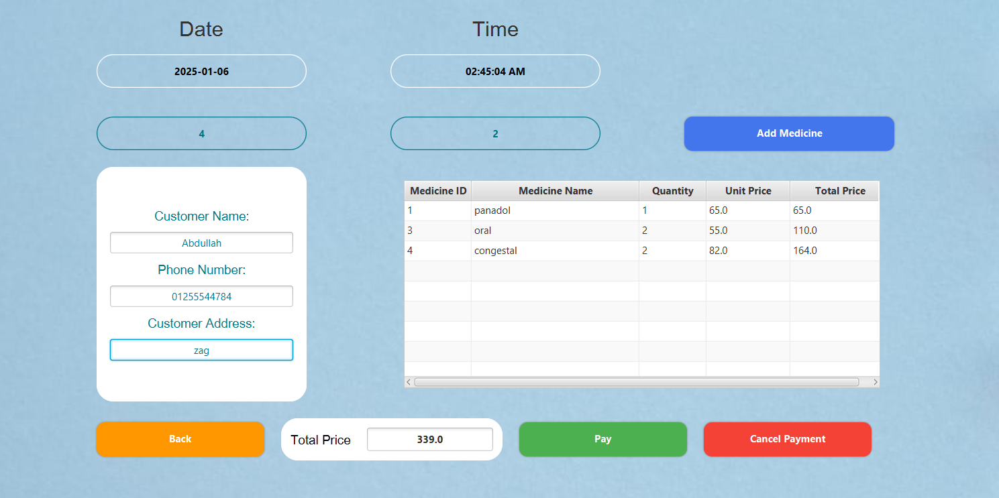
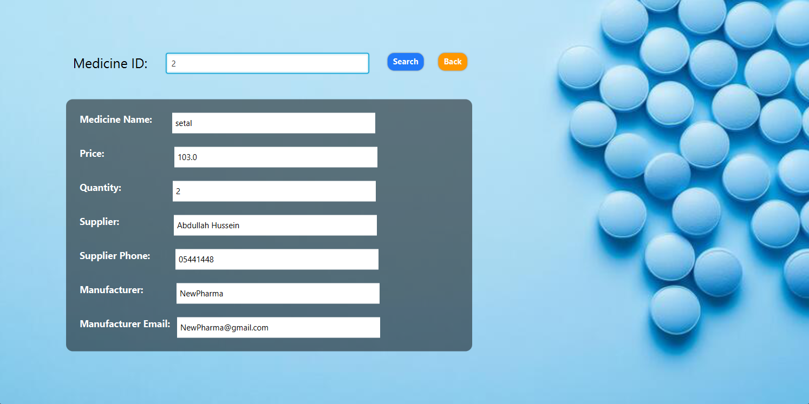
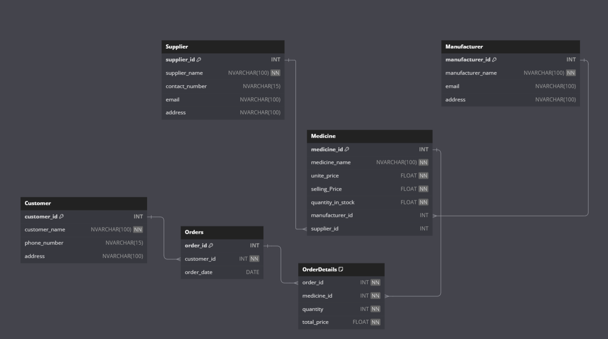

# Pharmacy Management System  

## Overview  
The Pharmacy Management System is a desktop application designed to streamline pharmacy operations. It simplifies processes such as managing inventory, suppliers, and manufacturers, selling medicines, and generating reports on stock shortages. Built using modern Java tools, this system ensures efficiency and ease of use for pharmacy staff and management.  

---

## Features  

1. **Main Menu**  
   - A centralized menu to access various operations in the system.  

2. **Add Medicine**  
   - Add new medicines to the database with details such as name, category, and price.  

3. **Add Supplier**  
   - Register new suppliers with their contact information and company details.  

4. **Add Manufacturer**  
   - Add and manage details about medicine manufacturers.  

5. **Sell Medicine and Generate Invoice**  
   - Handle medicine sales and create detailed invoices for customers.  

6. **Search for Medicine**  
   - Quickly search and retrieve information about any medicine in the database.  

7. **Low Stock Report**  
   - Generate a report of medicines that are running low in stock, including supplier contact details for easy restocking.  

8. **Update Medicine Details**  
   - Edit and update existing medicine records to ensure accurate and up-to-date information.  

---

## Technologies Used  

- **JavaFX**  
   - For building a modern, interactive, and user-friendly graphical interface.  

- **JDBC (Java Database Connectivity)**  
   - For seamless interaction between the application and the database.  

- **MS SQL Server**  
   - A robust relational database system for storing and managing all data efficiently.  

---
## Main Menu

## Add Medicine

## Add Supplier

## Add Manufacturer

## Sell Medicine and Generate Invoice

## Search for Medicine

## Low Stock Report

## Update Medicine Details

## Database 

